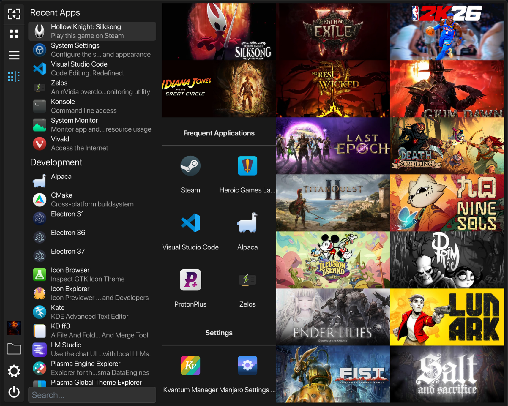
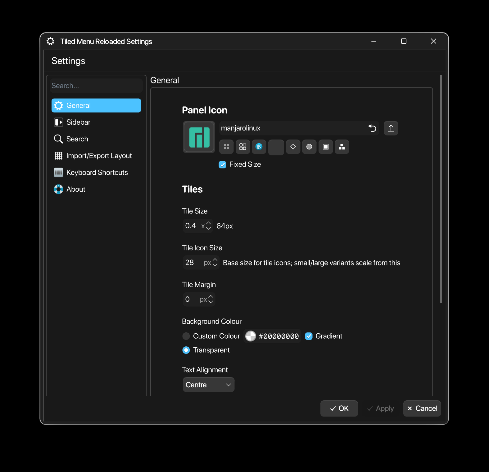

# Tiled Menu Reloaded

Tiled Menu Reloaded is a Plasma applet that provides a tiled launcher loosely inspired by Windows 10's start menu. It offers flexible tile layouts, groupable tiles, and configurable shortcuts while targeting Plasma 6 and Qt6 compatibility. *Used various LLMs as a playground for code generation and assistance in forking/structuring the project.*

Origins
- Forked from firefly75's Tiled Menu: https://github.com/firefly75/plasma-applet-tiledmenu
- Original project by zren: https://github.com/Zren/plasma-applet-tiledmenu

Key goals:
- Provide an attractive, editable tile-based application launcher.
- Make common launcher workflows (pinning, grouping, quick search) fast and discoverable.
- Support modern Qt6/Plasma 6 environments.

Highlights
- Tile-based launcher with configurable sizes (1×1, 2×2, 4×4, and mixed layouts).
- Group tiles with headers; move and sort items within groups.
- Drag-and-drop pinning from file manager and search results.
- Animated tile support (GIF, APNG, SVG) and per-tile background images.
- Configurable sidebar shortcuts and search filters.
- Stores tile layout as a Base64-encoded XML fragment. Default preset images folder: ~/Pictures/TiledMenuReloaded

Screenshots

Installation
1. Copy the package to your local plasmoids directory:

    mkdir -p ~/.local/share/plasma/plasmoids/
    unzip <package>.zip -d ~/.local/share/plasma/plasmoids/

2. Restart Plasma Shell to load the new applet:

    kquitapp6 plasmashell && nohup plasmashell --replace > /tmp/plasmashell.log 2>&1 &

3. Add the applet: right-click your application launcher, choose "Show Alternatives", and select "Tiled Menu Reloaded".

Usage
- Pin items: right‑click an application or file and select "Pin" or drag it to the tile grid.
- Edit tiles: use the tile editor to change label, icon, background image, size, and placement.
- Groups: create a new group from the grid context menu; drag tiles into groups and use the group header to sort.
- Resize the popup: Meta + Right Click then drag; the size is persisted across restarts.

Configuration
- Settings are available from the applet configuration dialog. Important options include default tile folder, tile scale, grid columns, and search filters.

Contact
- Report issues at: https://github.com/Kombatant/plasma-applet-tiled_rld/issues

